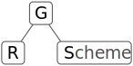

<br>

# GRScheme

GRScheme, or Graph-Reduction Scheme, is a simple scheme-like language written in
Rust as self-educational exercise.  This language is not intended for serious use.

## Building
Make sure you have Rust installed. If not, follow [official
guide](https://www.rust-lang.org/tools/install). After Rust was installed clone
this repo and run `cargo build`:

```
$ git clone https://gitlab.com/andreyorst/grscheme.git
$ cd grscheme
$ cargo build
```

To run simply use `cargo run` it is recommended to use `--release` build,
because it is much faster. Without any arguments it will start the REPL, and
with file specified as first argument it will run the file:

```
$ cargo run
    Finished dev [unoptimized + debuginfo] target(s) in 0.02s
     Running `target/debug/grscheme hello_world.grs`
Welcome to GRScheme.
> (display "hello world") (newline)
hello world
$ cat hello_world.grs
(display "hello world") (newline)
$ cargo run -- hello_world.grs
    Finished dev [unoptimized + debuginfo] target(s) in 0.02s
     Running `target/debug/grscheme hello_world.grs`
hello world
```

## Graph Reduction
Unlike many other languages, where we have to parse code and build abstract
syntax tree out of the information obtained while parsing, Scheme is a Lisp
derivative, which consists out of homoiconic S-expressions, which already form
the program tree. This means that we do not have to optimize tree, or make
complex transformations on parsing stage (unless we're talking about macros),
and the resulting tree can be later used directly as evaluation graph. Reducing
this graph from the bottom up will produce the result of the program.

This method of evaluation gives us certain advantages:

- We can have tail call elimination of any depth, e.g when `a` calls `b`, `b`
  calls `c`, ..., `z` calls `a`, in the tail position the amount of RAM should
  not raise;
- We can do branching by cutting down trees that we do not need, which is very
  effective;
- We can store information directly inside the tree, and tree itself will be
  garbage collector, because there's no cross references, reducing the tree
  also deallocates the data;
- Which means there's no stack or heap,
  - Except there is a heap, which is a global scope of our program where we
    store permanent identifiers as constants;
- We can parallelize graph reduction at any point of the graph and compute
  several branches simultaneously. Though current implementation isn't suited
  for such feature.

And this set of disadvantages:

- We're more or less locked to pure functional model of evaluation;
- We're more or less locked to immutable data structures;
- Side effects are possible only in nested expressions;
- If we parallelize, we have to lock access to the data that we may change (well,
as in any other language).

Which I personally see as another set of advantages, because those force writing
more strict code.

## Goals
This is my experiment at writing a language without knowing much about how to
actually write one. I'm going to explore jungle map-less. Here's what I have in
mind with this project (which actually may change over time):

- Have a small and fast language written in safe Rust;
- Be a pure functional language;
- Tail call elimination;
- Less parentheses in places where we should not need ones, like `cond` or `let`

## Non goals
I do not plan to evolve this language into a widespread mainstream Scheme
implementation that follows [r*rs](http://www.scheme-reports.org/) standard, and
I do not plan on building community around the language.

Some of this may change later on though. Who knows.

## Syntax
The goal syntax would be something like this:

- `1`, `-1`, `1.0`, `-1.0`, `22/7` - numeric constants,
- `"abc"` - string,
- `'(1 2 3)` - list,
- `'abc` - symbol,
- `abc` - identifier,
- `()`, `{}`, `[]` - procedure application, except in some special forms, and
  all have equal meaning, though must be balanced,
- `;` - line comment,
- `#` - pattern,
- `:` - pattern expansion
- `\` - escape.

Reserved characters, that are not allowed as part of names, neither by itself,
nor in escaped form:
- `(`, `)`, `{`, `}`, `[`, `]` - used for procedure application, lists,
- `'` - used for quoting identifiers, and list construction,
- `` ` `` - used for quasiquoting,
- `,` - used for unquoting in quasiquote,
- `#` - used for patterns,
- `;` - used for comments,
- `"` - used as a string delimiter,
- `\` - used to escape string delimiter in strings.

## Built in procedures
These procedures are part of the language core and are written in Rust:

- [x] `lambda` - create anonymous procedure;
  - [ ] or as `λ` which is a runtime binding to `lambda`;
- [x] `define` - bind name to value;
- [x] `quote` or prefix `'` - quote name or procedure call;
- [x] `quasiquote` or prefix <code>\`</code> - quasiquote name or procedure call;
- [x] `unquote` or prefix `,` - unquote symbol in quasiquote form;
- [ ] `unquote-splicing` or prefix `,@` - unquote
      list<sup>[1](#differences-with-other-schemes)</sup>;
- [x] `cons` - create cons cell;
- [x] `car` - get first value of a cons cell;
- [x] `cdr` - get second value of a cons cell;
- [x] `empty?` - check list for emptiness;
- [x] `length` - check list length;
- [x] `let` - create local bindings;
- [x] `cond` - multiple conditional branching;
- [x] `display` - print the name's value, or values directly;
- [x] `newline` - prints newline;
- [x] `read` - used to read user input and parse it to tree;
- [x] `progn` - evaluates expression in a sequence, returns the result of the
      last one;
- [x] `if` - branching with condition;
- [x] `eval` - evaluates quoted expression;
- [x] `+`, `-`, `*`, `/`, `%` - mathematical operators;
- [x] `<`, `>`, `<=`, `>=`, `=` - comparison operators;

### Procedure creation
All procedures except builtin ones are anonymous procedures and are created with
`lambda` procedure:

```
(lambda <argument list> <body>)
```

`lambda` accepts list of arguments with the first set of parenthesis, the rest
expressions are treated as body with implicit `progn` around it, and returns a
`#procedure`. For example procedure which computes square of number `x` is
defined like this:

```
> (lambda (x) (* x x))
#procedure:anonymous
```

We can apply procedure using extra set of parentheses around it and by providing
argument:

```
> ((lambda (x) (* x x)) 8)
64
```

The expression `(lambda (x) (* x x)` creates procedure with local name `x`
that exists only inside the scope of the procedure. So if procedure
returns another procedure, which uses the `x` name, it will be stored inside
returned procedure as value. For example:

```
> (((lambda (x) (lambda (y) (+ x y))) 1) 2)
3
```

When we apply `1` to the first lambda expression, `x` will be holding the `1`
value, and will be stored inside the `#procedure:anonymous` returned by `(lambda
(y) (+ x y))` as `1` thus making it `(lambda (y) (+ 1 y))`. When we apply `2` to
the resulting `#procedure:anonymous` it will compute `(+ 1 2)`.

### Name Definition
Names are used to hold data. Names are not variables and are immutable. Since
this language is pure functional, we can't assign twice to a name without
redefining it.

The syntax for define is as follows:

```
(define <name> <value>)
```

Names are defined with the `define` procedure, which takes two arguments as an
input and produces `#void`. Syntax is:

```
(define <name> <expression>)
```

This creates two names in global scope:

```
> (define abc 123)
> (define def "def")
```

We can not use numeric constants, strings, reserved characters, and white space
to define name names.

```
> (define -1 -1)
error
> (define "-1" -1)
error
> (define my name 22)
error
```

The `define` procedure is scope aware, and creates identifiers inside the scope
of the caller:

```
> (progn
    (define var 10))
> var
error, var undefined
```

names can store any kind of information: values, strings, procedures,
symbols, patterns:

```
> (define var1 22)
> var1
22
> (define var2 "22")
> var2
"22"
```

### Procedure creation
All procedures except builtin ones are anonymous procedures and are created with
`lambda` procedure. The syntax for `lambda` is:

```
(lambda <argument list or name> <body>)
```

`lambda` accepts list of arguments with the first set of parenthesis, or the
name directly, the rest expressions are treated as body with implicit `progn`
around it, and returns a `#procedure:anonymous`. For example procedure which
computes square of number `x` is defined like this:

```
> (lambda (x) (* x x))
#procedure:anonymous
```

We can apply procedure using extra set of parentheses around it and by providing
argument:

```
> ((lambda (x) (* x x)) 8)
64
```

The expression `(lambda (x) (* x x)` creates procedure with local name `x`
that exists only inside the scope of the procedure. So if procedure
returns another procedure, which uses the `x` name, it will be stored inside
returned procedure as value. For example:

```
> (((lambda (x) (lambda (y) (+ x y))) 1) 2)
3
```

When we apply `1` to the first lambda expression `x` will be holding the `1`
value, and will be stored inside the `#procedure` returned by `(lambda (y) (+ x
y))` as `1` thus making it `(lambda (y) (+ 1 y))`. When we apply `2` to the
resulting `#procedure` it will compute `(+ 1 2)`.

Creating named procedures is done with `define`. When names are holding
`#procedure:anonymous` those also can be used for procedure application:

```
> (define square (lambda (x) (* x x)))
> square
#procedure:square
> (square 4)
16
```

## Special forms
Scheme and Lisps feature some special forms, such as `if` `let` `cond` that can
have some parentheses represent not what those usually do. Because `let` and
`cond` require additional parsing rules, so their form may be changed in order
to make parsing simpler. Some forms were added in addition, like `match` to
provide more flexible branching of the program.

### The `if` procedure
Used for branching the program. The syntax is:

```
(if <boolean>
    <true expression>
    <false expression>)
```

`if` procedure accepts `boolean` or as first argument. Booleans are written as
patterns: `#t` `#f`, everything that is not `#f` is treated as `#t`. For
example, comparison of two numbers returns `boolean`:

```
> (= 1 2)
#f
> (= 2 2)
#t
> (if (= 1 2)
      "wrong"
      "ok")
"ok"
>
```

Because only one of `if` arms is evaluated this is a special form.

### The `cond` procedure
`cond` is similar to `if` but has more than two arms. `cond` checks if current arm
holds `#t` in the place of the first argument, and if it is `#t` the rest of the
code in the arm is executed, and `cond` returns the value of last executed
expression as the result. If arm is holding `#f` it doesn't get executed, and
the next arm is evaluated, thus only first arm which holds `#t` will be
evaluated. The syntax is:

```
(cond <boolean arm 1>
      <expression 1>
      ...
      <boolean arm N>
      <expression N>)
```

Unlike most Scheme implementation there's no need for additional parentheses
around arms. For example:

```
> (cond (= 1 2) "what?"
        (not (= 1 1)) "WHAT???"
        #t "all good")
"all good"
>
```

If there's no end arm with `#t` value and no arm returned it the result is
`#void`:

```

> (cond (= 1 2) "what?"
        (not (= 1 1)) "WHAT?")
#void
>
```

Because `cond` executes its arms in order it doesn't spawn threads, and arms are
executed only when it holds `#t`, similarly to `if`, `cond` is a special form.

### The `let` procedure
`let` is used to create local bindings. The syntax is:

```
(let (<binding 1>
      <value 1>
      ...
      <binding N>
      <value N>)
  <body expression 1>
  ...
  <body expression N>)
```

Unlike most other Scheme implementations there's no need for additional
parentheses around bindings. For example:

```
> (let (var1 10
        var2 20)
    (+ var1 var2))
30
```

## Differences with other Schemes
Currently some things behave differently from other Scheme implementation, due
to internal model of evaluation of GRScheme. For example, in Scheme `quote`
returns a name, or list the was passed to it and this name or list is not
evaluated. GRScheme on the other hand returns quoted form, because if it is not
quoted it is evaluated. Thus, in GNU Guile `'(a b)` expression produces `(a b)`
and in GRScheme it produces `'(a b)`. Internal procedures, such as `car`, `cdr`,
`cons`, and variadic lambdas expect quoted forms and know how to deal with
those, thus `(cons 'a '(b))` yields `'(a b)`. `car` of that list will yield
`'a`.

`unquote-splicing` currently is not implemented, and unlikely will be possible
in current evaluation model.

## How to help
Force me to finish SICP, please.
